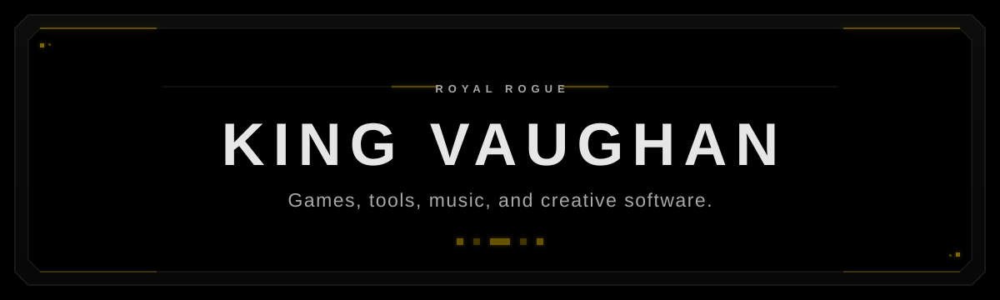
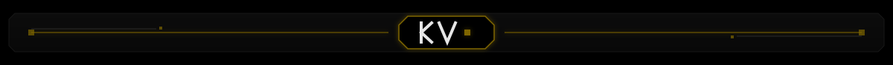

  

## About

I am King Vaughan, a multidisciplinary creator working across game development, desktop software, music, audio technology, and digital art. I build focused projects that bring technical systems and creative work together.

## Projects

- **Shots and Shapes** — A private work in progress: an endless neon arena shooter built around score-chasing, pressure, and repeat runs.
- **Local Markdown Notes** — A private preview of a local-first Windows application for a focused, fast Markdown workflow.
- **High Court** — An evolving creative identity connecting my games, music, audio technology, and digital work.

## Tools

- **Game development:** Godot, GDScript
- **Desktop applications:** C#, .NET, WPF
- **Web:** HTML, CSS, JavaScript
- **Visual work:** Blender, digital art
- **Music and audio:** production, mixing, mastering, sound design
- **Audio software:** VST development

## Links

- [GitHub](https://github.com/KingVaughan)
- [High Court](https://high-court-website.pages.dev/)

## Contributions

  

  

