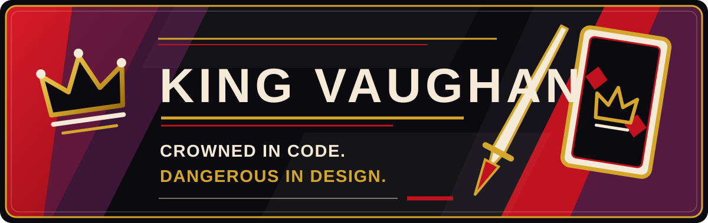
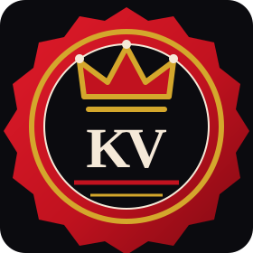

  

  <strong>Creative Technologist &nbsp;•&nbsp; Game Developer &nbsp;•&nbsp; Music Producer</strong> 
  <em>Crowned in code. Dangerous in design.</em>

  I bring game development, music production, digital art, audio technology, and entrepreneurship into one creative practice—building expressive work with both technical discipline and a little theatrical flair.

  <a href="https://high-court-website.pages.dev/"><strong>Enter High Court →</strong></a>

  

## The Rogue Behind the Crown

I’m **Xavier Vaughan**, a multidisciplinary creator working where technology and expression meet. My practice spans game development, music production, audio technology, digital art, and entrepreneurship—different rooms in the same court, each sharpening the next.

## Current Quests

> **Shots and Shapes** 
> *In development · private work in progress* 
> An endless neon arena shooter built around score-chasing, pressure, and one-more-run energy.

> **Local Markdown Notes** 
> *Private preview · local-first Windows application* 
> A focused Markdown workspace designed to keep writing close, fast, and under the user’s control.

> **High Court** 
> *Evolving creative identity* 
> The connective world for my games, music, audio technology, and digital work.

## Royal Arsenal

These are the tools and disciplines currently in my working arsenal—not a mastery meter, but an honest map of where I build.

- **Game development** — Godot · GDScript
- **Desktop applications** — C# · .NET · WPF
- **Web craft** — HTML · CSS · JavaScript
- **Visual workflows** — Blender · digital art
- **Audio production** — music production · mixing · mastering · sound design
- **Audio technology** — VST · audio-software development

## Enter the Court

**[High Court](https://high-court-website.pages.dev/)** is the public doorway into my wider creative identity.

> **Interactive portfolio — coming soon** 
> A future, hands-on showcase is reserved for `kingvaughan.github.io`. The address will become an active link when the experience is ready for company.

<!--
Reviewed public links can be added here later:
- GitHub Pages: https://kingvaughan.github.io/
- itch.io: [add reviewed public URL]
- Gumroad: [add reviewed public URL]
- YouTube: [add reviewed public URL]
- Professional contact: [add reviewed public contact method]
-->

  

  

  <strong>Built with intent. Worn with a little defiance.</strong>

